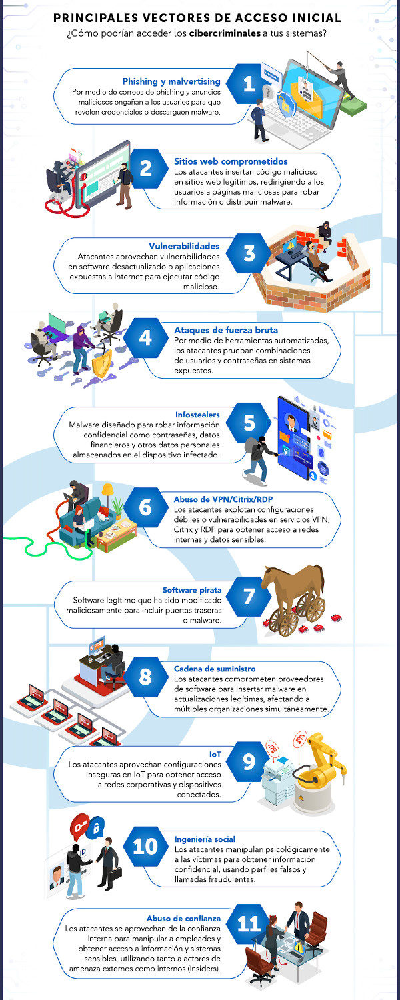

# Cubrir investigación de tipos de ransomware y vectores de ataque típicos, nombrar o describir algunos casos recientes

## Tipos de vectores de ataque para ransomware

[Descripción tipos de vectores](https://blog.scilabs.mx/principales-vectores-de-acceso-inicial-en-ataques-de-ransomware/)

## Tipos de ransomware
Los ransomware son principalmente de dos tipos:

**Ransomware de bloqueo.**
    Diseñado para bloquear funciones básicas del equipo. Puede, por ejemplo, impedir el acceso al escritorio del sistema y restringir parcialmente el uso del teclado y del mouse.

**Ransomware de cifrado.** 
    Diseñado para cifrar los archivos más importantes de la víctima, como sus documentos, fotos y videos. El funcionamiento del equipo no se ve afectado. La víctima entra en pánico porque ve que sus archivos siguen allí, pero no puede abrirlos. Esta clase de malware muestra una leyenda en la que se exige el pago de un rescate y, por lo general, una cuenta regresiva. 
    
[Tipos de ransomware](https://latam.kaspersky.com/resource-center/threats/ransomware-attacks-and-types?srsltid=AfmBOoqFQnTcv9Tb6p8WIxBS0B-L1QO17qn0RtgAvjEU13NRy4e-ys4e)

[Ejemplos de grupos de ransomware conocidos](https://www.trendmicro.com/es_es/what-is/ransomware/ransomware-examples.html)

[Web para identificar que ransomware ha infectado la máquina](https://id-ransomware.malwarehunterteam.com/index.php?lang=es_ES)

## Ciclo de vida de un ataque ransomware

## Vídeo con explicación de técnicas, tácticas y procedimiento (TTP) de ransomware
Ejemplo de acceso inicial, persistencia, elevación de privilegios, evasión de defensas, movimientos laterales y exfiltración.
[Vídeo](https://www.youtube.com/watch?v=-BZJ6Xz7DzI)

## Proceso de ataque con ransomware Ryuk con vector de ataque por Phising

[Vídeo explicación del proceso](https://www.youtube.com/watch?v=PZqM8pwrLdQ&t=1368s)

### Caracteristicas y funcionamiento de Emotet para inciar ataque a través de email:
<a href="https://www.incibe.es/incibe-cert/blog/emotet-caracteristicas-y-funcionamiento" target="_blank">https://www.incibe.es/incibe-cert/blog/emotet-caracteristicas-y-funcionamiento</a>

Repositorio para obtener malware:

[Emotet](https://github.com/jstrosch/malware-samples/tree/master/maldocs/emotet/2021/December)

[Trickbot](https://github.com/jstrosch/malware-samples/tree/master/maldocs/trickbot/2018/November)

[Binarios Emotet](https://github.com/jstrosch/malware-samples/tree/master/binaries/emotet/2019/October)

[Binarios Trickbot](https://github.com/jstrosch/malware-samples/blob/master/binaries/trickbot/2020/June/samples_pcap.zip)

## Ejemplos
[Ataque al SEPE con ransomware Ryuk](https://www.esedsl.com/blog/ryuk-el-ransomware-que-consiguio-tumbar-las-defensas-del-sepe-y-que-amenaza-a-cualquier-empresa)