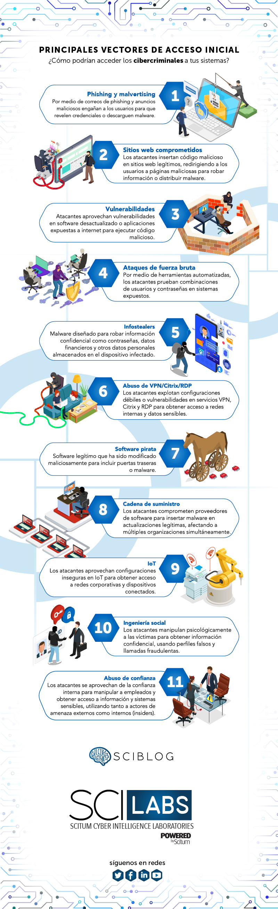
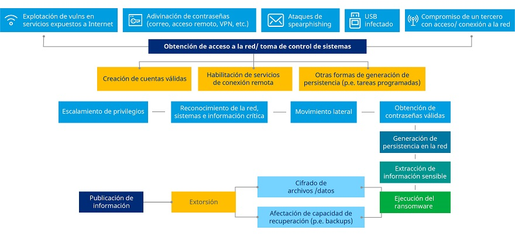

# Cubrir investigación de tipos de ransomware y vectores de ataque típicos, nombrar o describir algunos casos recientes

## Tipos de vectores de ataque para ransomware

[Tipos Vectores](https://blog.scilabs.mx/principales-vectores-de-acceso-inicial-en-ataques-de-ransomware/)

## Ciclo de vida de un ataque ransomware

## Vídeo con explicación de técnicas, tácticas y procedimiento (TTP) de ransomware
Ejemplo de acceso inicial, persistencia, elevación de privilegios, evasión de defensas, movimientos laterales y exfiltración.
[Vídeo](https://www.youtube.com/watch?v=-BZJ6Xz7DzI)

## Proceso de ataque con ransomware Ryuk con vector de ataque por Phising

[Vídeo explicación del proceso](https://www.youtube.com/watch?v=PZqM8pwrLdQ&t=1368s)

Caracteristicas y funcionamiento de Emotet para inciar ataque a través de email:

[Vídeo](https://www.incibe.es/incibe-cert/blog/emotet-caracteristicas-y-funcionamiento)

Repositorio para obtener malware:
[Emotet](https://github.com/jstrosch/malware-samples/tree/master/maldocs/emotet/2021/December)

[Trickbot](https://github.com/jstrosch/malware-samples/tree/master/maldocs/trickbot/2018/November)

[Binarios Emotet](https://github.com/jstrosch/malware-samples/tree/master/binaries/emotet/2019/October)

[Binarios Trickbot](https://github.com/jstrosch/malware-samples/blob/master/binaries/trickbot/2020/June/samples_pcap.zip)

## Ejemplos
[Ataque al SEPE con ransomware Ryuk](https://www.esedsl.com/blog/ryuk-el-ransomware-que-consiguio-tumbar-las-defensas-del-sepe-y-que-amenaza-a-cualquier-empresa)