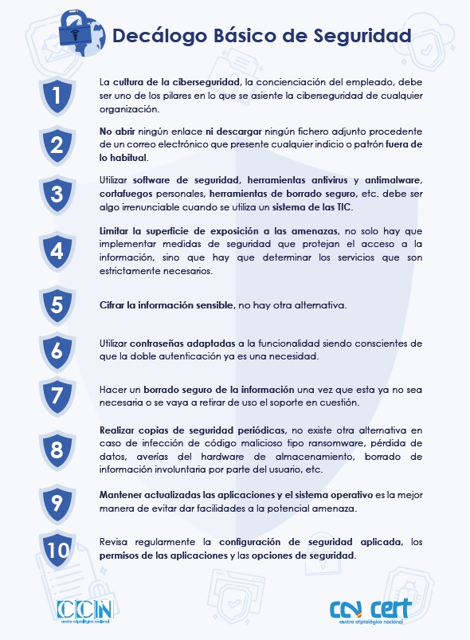
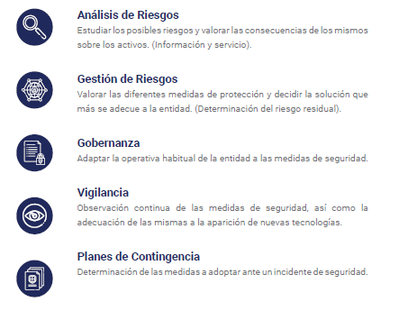
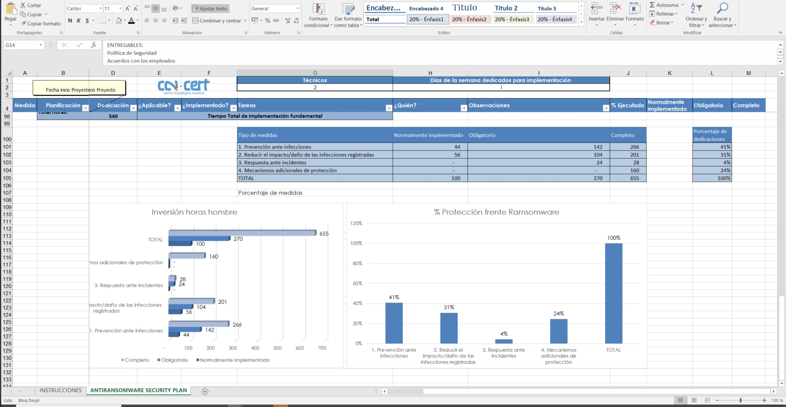

# Prevención de ataques, que se puede hacer, cuales son las técnicas, estándares o herramientas que se deberían emplear para mitigar o incluso recuperarse de un ataque, e.j. gestión de backups

## Decálogo básico de seguridad
A modo genérico para cualquier tipo de ataque, la concienciación, el sentido común y las buenas prácticas son las mejores defensas.

## Implementación de seguridad en las empresas
El usuario siempre es el eslabon más debil en la cadena de protección pero las empresas deben tener un plan de seguridad donde se identifiquen los riegos y se incluyan los planes para mitigar cada uno de los riesgos que no se haya decidido asumir.

**Frente a un escenario donde cada vez más usuarios son aleccionados sobre los ataques informáticos y los métodos más frecuentes de infección (en definitiva, más concienciados con la seguridad informática), los creadores de malware (de forma generalizada) adaptan sus métodos con el propósito de extender sus ejecutables en procesos sin interacción con el usuario.**

La implemenatación de la seguridad en las empreseas conlleva planificar y tener en cuenta los siguientes elementos

## Medidas de protección específcas basadas en los diferentes vectores de ataque
En este documento podemos encontrar una guia elaborada por la OSI (Oficina de seguridad del internauta) donde se enumeran las mediadas recomendadas para la protección ante los difernetes vectores de ataque (Ataques por fuerza bruta, Ataques basados en ingeniería social, Ataques a conexiones, Ataques por malware ... )
<a href="./assets/osi-guia-ciberataques.pdf" target="_blank">osi-guia-ciberataques</a>

En concreto frente a un ataque por Ransomeware como RYUK las medidas de protección son

- **Mantener copias de seguridad periódicas de todos los datos
importantes.** Es necesario mantener dichas copias aisladas y
sin conectividad con otros sistemas, evitando así el acceso
desde equipos infectados.

- **Mantener el sistema actualizado con los últimos parches de
seguridad,** tanto para el sistema operativo como para el software
que hubiere instalado.

- **Políticas BYOD (Bring Your Own Device).** Cada vez es más
habitual son un potencial vector de infección y es por ello por lo que es
imprescindible definir unas reglas de seguridad.

- **Contraseñas seguras.** 

- **Mantener una primera línea de defensa con las últimas firmas
de código dañino (antivirus),** además de disponer de una correcta
configuración de los cortafuegos a nivel de aplicación
(basado en listas blancas de aplicaciones permitidas).

- **Disponer de sistemas antispam a nivel de correo electrónico
y establecer un nivel de filtrado alto.** De esta manera, se reducen
las posibilidades de infección a través de campañas masivas
de ransomware por correo electrónico.

- **Establecer políticas de seguridad en el sistema para impedir
la ejecución de ficheros desde directorios comúnmente utilizados
por el ransomware (App Data, Local App Data, etc.).** Herramientas
como AppLocker, Cryptoprevent o CryptoLocker
Prevention Kit permiten crear fácilmente dichas políticas.

- **Bloquear el tráfico relacionado con dominios y servidores C2
mediante un IDS/IPS, evitando así la comunicación entre el código
dañino y el servidor de mando y control.**

- **No utilizar cuentas con privilegios de administrador,** lo que
permite reducir el potencial impacto de la acción de un ransomware.

- **Mantener listas de control de acceso para las unidades mapeadas
en red.** En caso de infección, el cifrado se producirá en
todas las unidades de red mapeadas en el equipo víctima. Restringiendo
los privilegios de escritura en red se mitigará parcialmente
el impacto

- **Se recomienda el empleo de bloqueadores de Javascript para
el navegador, como por ejemplo “Privacy Manager”, que impide
la ejecución de todos aquellos scripts que puedan suponer un
daño para nuestro equipo.** De este modo se reducen las opciones
de infección desde la web (Web Exploit Kits).

- **Mostrar extensiones para tipos de fichero conocidos, con el
fin de identificar posibles archivos ejecutables que pudieren
hacerse pasar por otro tipo de fichero.**

- **Adicionalmente, se recomienda la instalación de la herramienta
“Anti Ransom”, que tratará de bloquear el proceso de
cifrado de un ransomware (monitorizando “honey files”).** Además,
esta aplicación realizará un volcado de la memoria del
código dañino en el momento de su ejecución, en el que con
suerte se puede hallar la clave de cifrado que estuviera empleándose.

- **Finalmente, el empleo de máquinas virtuales evitará en un alto
porcentaje de casos la infección por ransomware.** Debido a las
técnicas anti-debug y anti-virtualización comúnmente presentes
en este tipo de código dañino, se ha demostrado que en un
entorno virtualizado su acción no llega a materializarse.
<a href="./assets/CCN-CERT_BP_04_Ransomware.pdf" target="_blank">CCN-CERT_BP_04_Ransomware</a>

## EJEMPLO PLAN DE IMPLANTACIÓN SEGURIDAD
CNN-CERT pone a disposicon de los usuarios un check list para la implementación de medidas de protección frente al ataque ransomware
<a href="./assets/Checklist CCN-CERT BP-04 Ransomware ES.xlsx" target="_blank">Checklist CCN-CERT BP-04 Ransomware</a>

Identificadas las medidas ayuda a evaluar la situación en la que se encuentra la empresa

Ver como realizar Plna de Contingencia y Continuidad de un negocio
<a href="./assets/Plan_de_Contingencia_y_Continuidad_de_Negocio.pdf" target="_blank">Plan_de_Contingencia_y_Continuidad_de_Negocio</a>

## ANTI RANSOM COMO TRAMPA PARA CAPTURAR AL MALWARE. Honeypots o sistemas trampa

Una de las formas de detectar las infecciones por ransomware es instalar en la maquina un sistema trampa o honeypot26, que actúa como
señuelo que delata la presencia del código dañino.

Anti Ramson, una aplicación de código abierto capaz de detectar y detener los ataques de ransomware, sin importar su categoría. 

En primer lugar, la herramienta crea una carpeta de señuelo al azar con muchos documentos sin utilidad, por ejemplo Excel, PDF o Word, y lleva a cabo una supervisión para ver si se producen cambios. En caso de que el sistema detecte que ha tenido lugar algún cambio, trata de identificar los procesos responsables de esta alteración, los detiene y vuelca la memoria de los procesos, con la esperanza de que la clave o la contraseña que utiliza el virus para cifrar los archivos esté en su interior.

En este enlace se encuentran las instrucciones para la preparación del entorno señuelo y la instalación de la aplicación:
<https://www.security-projects.com/?Anti_Ransom>

## File History para almacenar copias de seguridad en un medio extraíble y Shadow Copies
La medida más efectiva contra el ransomware es disponer siempre de
varias copias de respaldo de todos los ficheros importantes. De hecho,
la extorsión sólo se da cuando el ransomware atacante ha conseguido
cifrar ficheros que son únicos e irrecuperables y no queda más remedio
que pagar el rescate si se quieren recuperar. Es esencial disponer
de al menos una copia de seguridad de todos los ficheros importantes,
de modo que se pueda recurrir a esa copia de respaldo cuando haga
falta recuperarlos.

Es muy importante establecer políticas de respaldo e implementar copias fuera de la red
En este video se muestran los aspectos a considerar a la hora de definir las políticas de respaldo.
[Vídeo](https://www.youtube.com/watch?v=NXkhXNFaKbs)

## Cómo actuar en caso de ser infectado

PRIMER PASO **Desconectar el equipo de la red** Con esto se consigue:
- Evitar que la acción de cifrado alcance al contenido alojado en
las unidades de red accesibles desde el equipo infectado.
- Eludir que el código dañino pueda contactar con su servidor de
mando y control.

SEGUNDO PASO **Tratar de identificar el proceso dañino**
La herramienta Monitor de Recursos de Windows.
Para acceder a ella, basta con ejecutar “resmon” (tecla
Windows + r).
Se debe prestar atención a lo siguiente:
    - **Procesos de aplicaciones que realmente no se estén ejecutando:**
    si se observa que en la lista de procesos aparece uno con el nombre
    de una aplicación como, por ejemplo, “notepad.exe” o “calc.
    exe”, y dicha aplicación realmente no está abierta, es muy probable
    que se trate de un proceso dañino disfrazado de aplicación inocua.
    - **Identificar procesos repetidos con diferente PID8: si aparecen varias
    veces procesos con el mismo nombre, estos pueden ser identificados
    mediante su PID.** Todos esos procesos deben depender
    de uno original y ser parte de su árbol de procesos. En el caso de
    que haya alguno fuera de ese árbol, probablemente se trate de un
    proceso dañino.
    - **Procesos con una gran cantidad de ficheros abiertos o con un
    excesivo uso de la CPU o del disco:** el proceso de cifrado es costoso
    en cuanto al consumo de recursos, por lo que el proceso atacante
    usará una gran cantidad de los mismos, sobre todo CPU y
    acceso a disco.

TERCER PASO **Identifiar el Ransomware**
Es importante conocer qué variante de ransomware ha infectado los
equipos afectados, y para ello se puede utilizar alguno de estos servicios:
**NoMoreRansom o IDRansomware**

Existe una utilidad, frecuentemente actualizada, que recopila información sobre todas las familias de ransomware conocidas (herramientas
de recuperación, fechas de aparición, etc.). Se recomienda consultarla si se ha sido víctima de una infección, de manera que se pueda conocer
la información disponible sobre el ataque y, si fuera necesario, conseguir una herramienta de recuperación. Esta herramienta se puede encontrar
en el siguiente enlace:
<https://docs.google.com/spreadsheets/d/1TWS238xacAtofLKh1n5uTsdijWdCEsGIM0Y0Hvmc5g/pubhtml>

- Inicia el equipo Windows en modo seguro con funciones de red
- Eliminar el ransomware con una herramienta de tipo cleaner
- Realizar un segundo análisis para confirmar que el equipo está limpio
- Restaurar los archivos cifrados por el ransomware

**MITIGIAR LOS EFECTOS**
Una vez se ha sufrido una infección y los ficheros han sido cifrados,
estos se pueden recuperar por distintos medios:
- Mediante una herramienta especifica de descifrado 
- A través de la restauración del sistema, que permite recuperar los ficheros cifrados.

